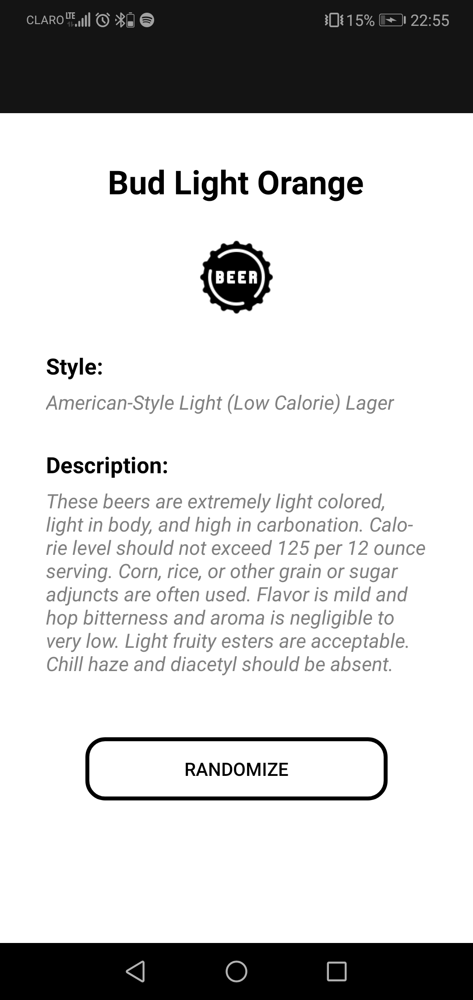

# API Sample App

This project implements a REST API in two differnt ways, using HTTP Client and Refit. The endpoint used gets a random beer from BreweryDB.

## Screen:

## *About the API implemented*

BreweryDB is the most complete database of breweries and beers. The offers a free sandbox environment, where we can experience the full capabilities of their API with limited data. Sample data has been selected with a wide variety of attributes to allow us to create our app and only pay once your app needs real, fresh BreweryDB product data.

For this project I used the GET: /beer/random endpoint, wich gets a random active beer.

